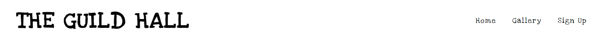
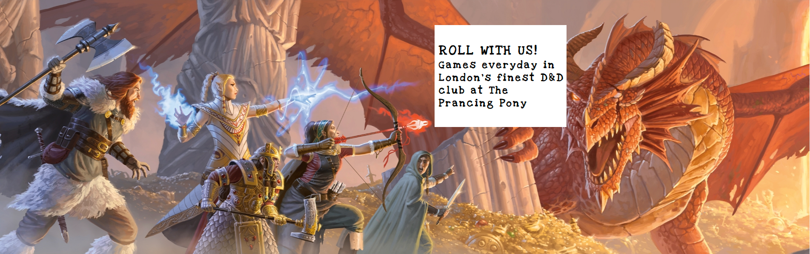
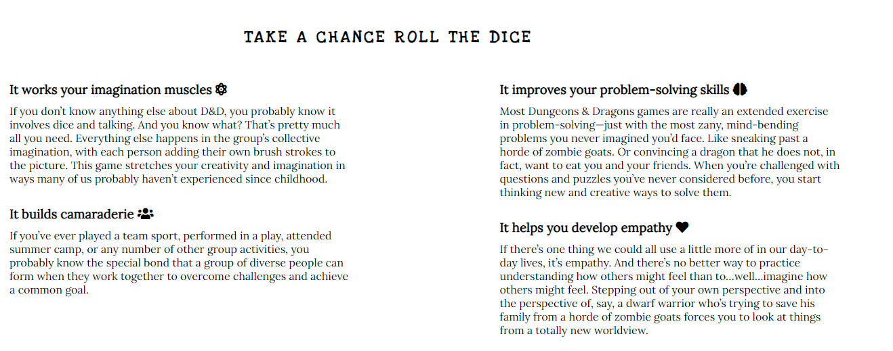
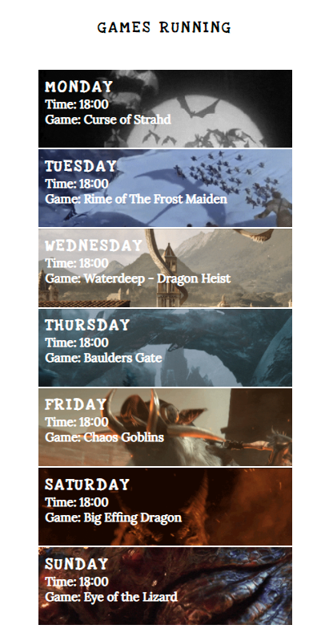
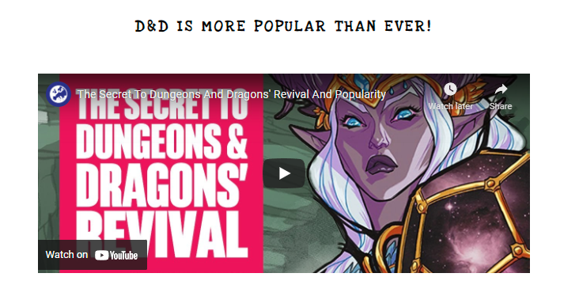
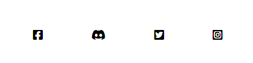
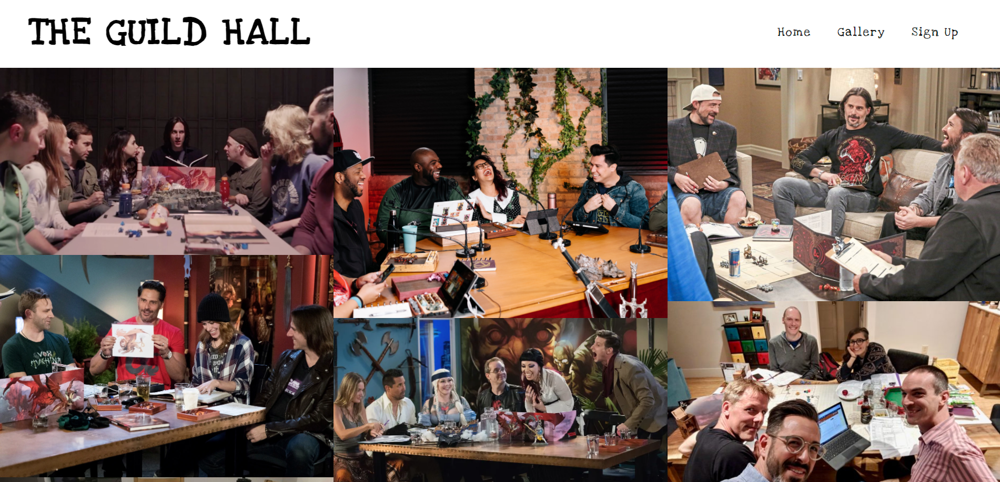
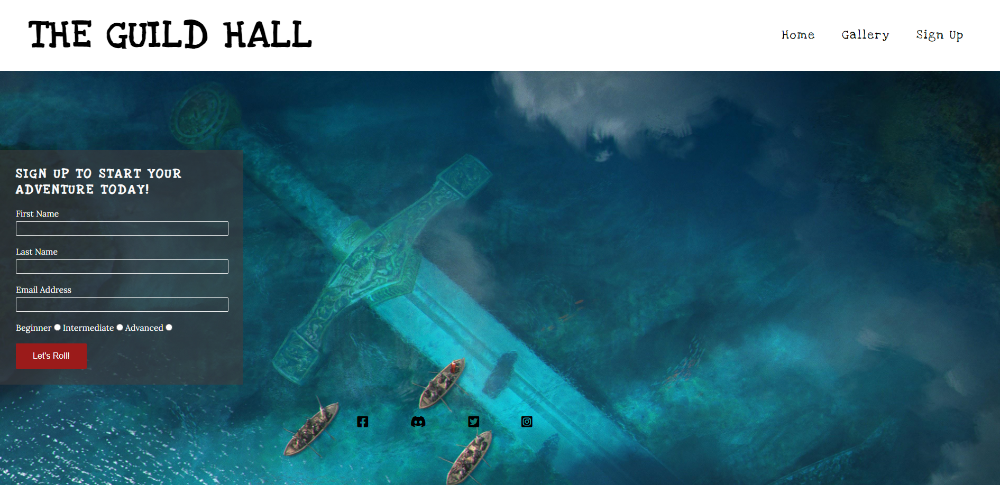
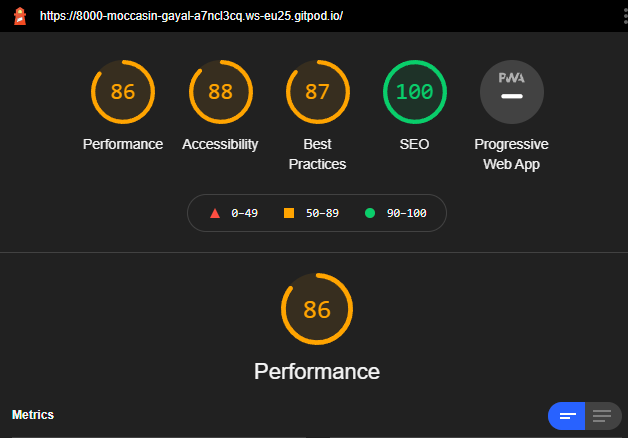

# The Guild Hall 

The Guild Hall is a site that helps players, both new and old to find Dungeons and Dragons games running in a fictitious tavern called "The Prancing Pony". 

It aims to entice new players into trying the game for the first time by giving them a number of reasons as to why they should take up the hobby and how the perception of the game and those who play it has changed. 

Nerd culture has exploded in recent years. Video games and being computer literate stopped becoming something only for Geeks decades ago. Comic books are fashionable now after the huge box office hits set in the MCU years after year. D&D has managed to ride this wave of Nerdism and become more popular than ever. 

I for one feel that everyone can benefit by taking up this amazing hobby and I hope this website encourages you to do so.  

  


## Features 

In this section, you should go over the different parts of your project, and describe each in a sentence or so. You will need to explain what value each of the features provides for the user, focusing on who this website is for, what it is that they want to achieve and how your project is the best way to help them achieve these things.

### Existing Features

- __Navigation Bar__

  - The navigation bar can be found at the top of each page. It allows for easy navigation to each page of the site, without the user having to use the 'back' button. I wanted to the menu buttons to change on hover as it reminded me of a "mimic" a famous monster from the D&D universe able to change into any inanimate object it wants. 

  


- __The landing page image__

  - The landing page image is a picture taken from the official WotC website and has a text overlay to catch the user's attention. the pictuire is a banner and will be wll know to seasoned D&D players as it is often seen on a Dungeons Masters screen. 


  

- __Club Ethos Section__


  - The club ethos section shows the user four good reasons why everyone should try playing dungeons and dragons and should encourage them to sign up to the club. There could obviously have been more reason but I did not want to overload the user with too much information and I will add links to videos and articles in the future. 

  


- __Games Times section__

  - The games times section allows the user to see what games are being played at which times and the gifs behind the text should also give some indication as to the theme of each game. I would not use gifs again as it reduces performace on mobile espically. Next time I would use picture or MP4 videos and suggested in the lighthouse report. 

  


- __The Video Section__


  - In the video section, I have included a YouTube video on the resurgence and rising popularity of Dungeons and Dragons in recent years. 

  


- __The Footer__ 


  - The footer section includes links to the relevant social media sites for The Guild Hall allowing easy access for the user. 

  


- __Gallery__

  - The gallery provides the user with pictures for them to have an idea of what a game looks like and would be able to help them identify people playing the game.  

  


- __The Sign Up Page__

  - This page allows the user to sign up for any current games. The user is asked to submit their name, email address, and current level of experience.

  


### Features Left to Implement

- In the future I would to add links to popular "Let's play groups" and other "content creators" to help the user see games being played and also learn how to be a better player. 
- I would also add links to online TTRGP site such as ROll20 and Fantasy Grounds as it is not always possiible for people to meet IRL. 

## Testing 

Testing come back with no errors but there is a warming in the gallery html: Warning: Section lacks heading. Consider using h2-h6 elements to add identifying headings to all sections. After so research I have decided it is safe to ignore the warning. 

To run tests, run the following command

```bash
  npm run test
```
W3C CSS Validator results
<p>
    <a href="https://jigsaw.w3.org/css-validator/check/referer">
        
    </a>
</p>

- __W3C HTML Validator results__

https://validator.w3.org/nu/?doc=https%3A%2F%2Famj-web.github.io%2FThe-Guild-Hall%2Fgallery.html

- __Responsive Design__

http://www.responsinator.com/?url=https%3A%2F%2F8000-moccasin-gayal-a7ncl3cq.ws-eu25.gitpod.io%2Findex.html

- __Lighthouse__

 

### Unfixed Bugs

There is a bug where the navbar does not display properly at very specific screen sizes, however, this did not affect the display in responsiator.com. It will be fixed as soon as possible. 

## Deployment

The site was deployed to GitHub pages. The steps to deploy are as follows:

In the GitHub repository, navigate to the Settings tab
From the source section drop-down menu, select the Master Branch
Once the master branch has been selected, the page will be automatically refreshed with a detailed ribbon display to indicate the successful deployment.

The live link can be found here - https://8000-moccasin-gayal-a7ncl3cq.ws-eu25.gitpod.io/

### Credits and Content

- [Awesome Readme Templates](https://awesomeopensource.com/project/elangosundar/awesome-README-templates)
- [Awesome README](https://github.com/matiassingers/awesome-readme)
- [How to write a Good readme](https://bulldogjob.com/news/449-how-to-write-a-good-readme-for-your-github-project)
- [Reasons to play credit to level1geek](https://www.level1geek.com/benefits-of-dungeons-and-dragons/)
- [Font Awesome Footer Icons](https://fontawesome.com/)
- [Gallery Pictures from Google images](https://www.google.com/search?q=people+playing+dnd&sxsrf=AOaemvJh3L35XwQ7y3MYChSdEXlUxk2yvg:1640694258239&source=lnms&tbm=isch&sa=X&ved=2ahUKEwjTzMmzvob1AhVCZMAKHXBxCL0Q_AUoAXoECAEQAw&biw=1920&bih=929&dpr=1)
- [Eurogamer YouTube video](https://www.youtube.com/watch?v=ypQ3kwYTDFI)
- [Hero Image](https://dnd.wizards.com/articles/media-resources/wallpapers)
- [Sign Up form](https://learn.codeinstitute.net/courses/course-v1:CodeInstitute+LR101+2021_T1/courseware/4a07c57382724cfda5834497317f24d5/4d85cd1a2c57485abbd8ccec8c00732c/)
- A special mention for the Code Insitute tutors who were excellent. 


